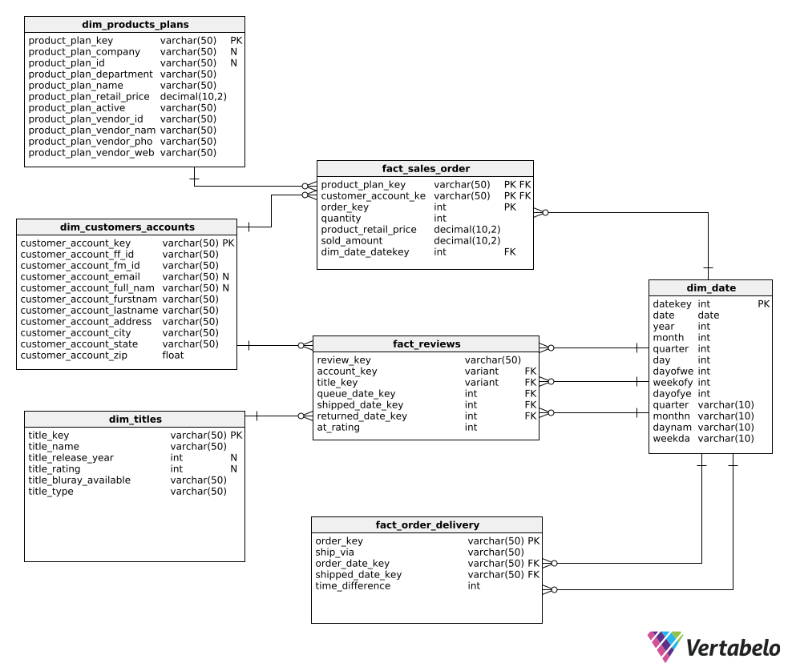

# Project Document

## Project Charter and team members

For our business case study, we will use the company FudgeCompanies which is the consolidation of 2 companies named FudgeMart and FudgeFlix. 

FudgeMart is a fictional brick-and-mortar company. The database is used to track sales orders, customers, and products.

FudgeFlix is a company based on the Netflix DVD-by-mail rental service. The database is used to track customers, movies, movie rentals, and billing.

### Team Members

Our team is conformed by the following professionals:
- Francisco del Castillo
- Divyanshu Srivastava
- Bhavika Mauli Karale
- Mrunal Ashok Nikam

## Project Plan

## Functional requirements
After much collaboration data profiling, we have established the following 4 functional business requirements:

1. FudgeMart Sales Order:
   
Senior management would like to be able to track sales by customer, product, department, and supplier, with the goal of establishing which products are the top sellers, which department has the most sales, and who are the best suppliers. 

2. FudgeFlix Revenue:

Senior management would like to be able to track income by account, plan, city, and state, with the goal of establishing which plans are the top sellers, which cities and states have the most revenue 

3. FudgeMart Order Delivery:

There is a need to analyze the order fulfillment process to see if the time between when the order is placed and when it is shipped can be improved. Senior Management wants to analyze by shipper.

4. FudgeFlix Reviews:
   
Management wants to create an analysis of ratings by account, state, city, movie title, release year, Blu-ray available, and title rating.

## Business Processes

We will model the following business processes 
1. FudgeMart Sales Order:

FudgeMart sells products to customers, these products have a department which is the combination of similar products, and each product also has a provider or vendor. Finally, one sale will be represented as one order and each order can have several lines or products with their respective quantity. 

2. FudgeFlix Revenue:

In this process we have accounts that are subscribed to different types of plans so they can get their movies, each plan has a different tier price and on the first day of each month, the company bills the accounts for the amount of their respective plan. 

# High-level dimensional modeling
## Bus matrix

The bus matrix for the project is in the following Excel file in the "bus matrix" tab.

[Bus Matrix](Dimensional-Modeling-Workbook.xlsx)

## Issues, questions or doubts

We encountered the following issues:
- How to combine the 2 databases into 1?
- What happens if the information is not the same?

Thankfully, with research, we could find the correct approach. 

# Detail-level dimensional modeling
## detail-level modeling
The detail-level modeling for the project is in the following Excel file under each dimension or fact tab. 

[Detail-level Modeling](Dimensional-Modeling-Workbook.xlsx)

Furthermore, this is the star schema of the detailed modeling. 

## Naming conventions and project standards

Our naming conventions are the following:
- Name the dimension tables in plural and our fact table in singular.
- Use snake_case project-wise.

# Initial loads Data Pipeline (ETL/ELT)
## Source code for the initial load

The source code for the initial data load (snowflake) is in the following file.

[Snowflake Code](Snowflake-code.txt)

## Source code for data pipeline

The source code for data pipelines is in the following files:

**Dimensions Tables:**
- [dim_customer_account](../fudgecompanies/models/dim_customer_account.sql)
- [dim_date](../fudgecompanies/models/dim_date.sql)
- [dim_products_plans](../fudgecompanies/models/dim_products_plans.sql)
- [dim_titles](../fudgecompanies/models/dim_titles.sql)

**Fact Tables:**
- [fact_sales_order](../fudgecompanies/models/fact_sales_order.sql)
- [fact_order_delivery](../fudgecompanies/models/fact_order_delivery.sql)
- [fact_review](../fudgecompanies/models/fact_review.sql)

**One Big Table:**
- [obt_sales_orders](../fudgecompanies/models/obt_sales_orders.sql)

## Documentation for data pipelines
The documentation for data pipelines is in the following files:

**Sources:**
- [Sources](../fudgecompanies/models/sources.yml)

**Dimensions Tables:**
- [dim_customer_account](../fudgecompanies/models/dim_customer_account.yml)
- [dim_date](../fudgecompanies/models/dim_date.yml)
- [dim_products_plans](../fudgecompanies/models/dim_products_plans.yml)
- [dim_titles](../fudgecompanies/models/dim_titles.yml)

**Fact Tables:**
- [fact_sales_order](../fudgecompanies/models/fact_sales_order.yml)
- [fact_order_delivery](../fudgecompanies/models/fact_order_delivery.yml)
- [fact_review](../fudgecompanies/models/fact_review.yml)

## Other documentation
Data quality, master data or survivorship rules

For our first and second business processes, we combined 2 databases, in order to combine both databases successfully we followed certain survivorship rules. These survivorship rules are as follows:
- we used the email as a key for merging the customers of both datasets. We used the FudgeFLix database as the primary source and the survivor source in case that the name, address, city, state, and zip code did not match.

# Business Intelligence
## BI Documentation
We have developed a tactical analytical tool using Power BI. Within the application, you will find the analytical tool for the first and second processes on the first tab, and for the third and fourth processes on the second tab.

## Application
[Link of PowerBI dashboard](https://app.powerbi.com/groups/me/reports/b0c9b159-8736-4ddb-9b80-daf1be6d883e/ReportSection?experience=power-bi)
